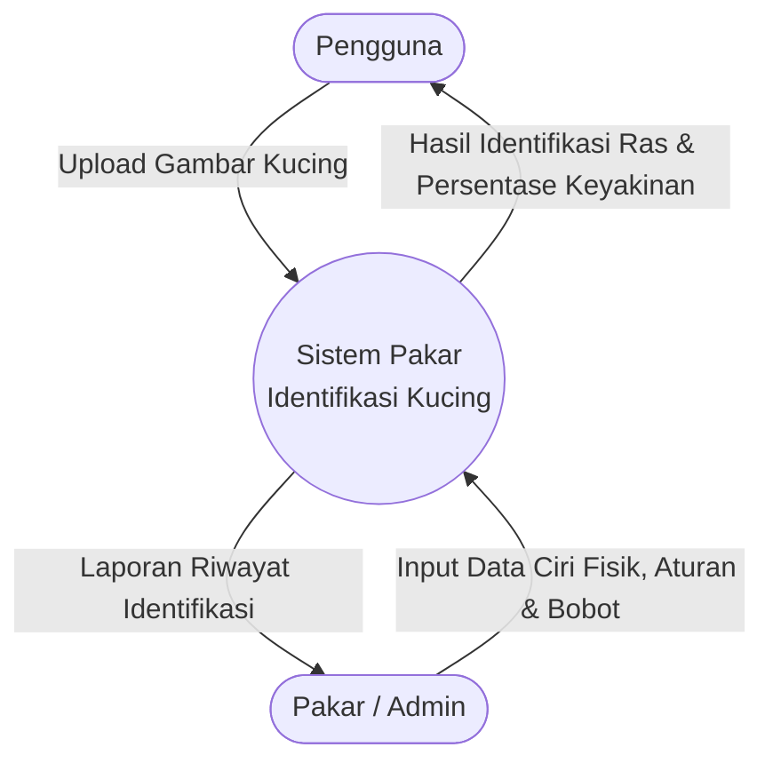
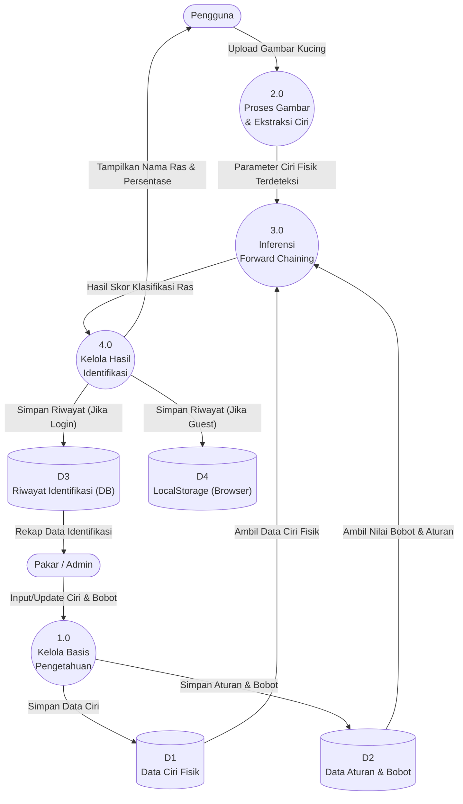
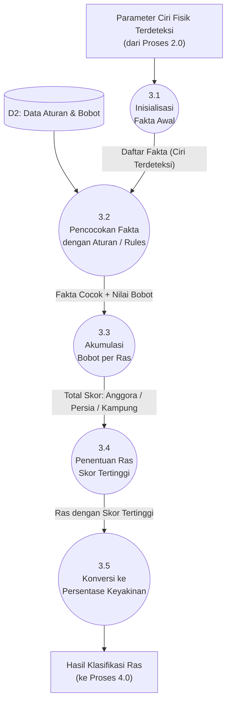

# Data Flow Diagram (DFD)
## Sistem Pakar Identifikasi Jenis Kucing Berdasarkan Ciri Fisik

Dokumen ini berisi perancangan aliran data sistem pakar menggunakan **MermaidJS** dalam format DFD (Data Flow Diagram) Level 0 hingga Level 2.

---

## DFD Level 0 — Context Diagram

Menggambarkan sistem secara keseluruhan sebagai satu proses tunggal beserta entitas-entitas luar yang berinteraksi dengannya.

---

## DFD Level 1 — Diagram Aliran Proses Utama

Memecah sistem menjadi 4 proses utama beserta penyimpanan data (Data Store) yang terlibat.

---

## DFD Level 2 — Detail Proses 3.0: Inferensi Forward Chaining

Memecah Proses 3.0 menjadi langkah-langkah detail yang terjadi di dalam mesin inferensi Forward Chaining.

---

## Keterangan Simbol DFD

| Simbol | Keterangan |
|--------|-----------|
| `([...])` | **Entitas Luar** — Pengguna atau Admin yang berinteraksi dengan sistem |
| `((...))`  | **Proses** — Aktivitas/fungsi yang mengolah data |
| `[(...)]`  | **Data Store** — Tempat penyimpanan data (database/tabel/local storage) |
| `-->`      | **Aliran Data** — Arah perpindahan data antar elemen |

---

## Ringkasan Proses

| No | Proses | Keterangan |
|----|--------|-----------|
| 1.0 | Kelola Basis Pengetahuan | Admin mengelola ciri fisik, aturan, dan nilai bobot |
| 2.0 | Proses Gambar & Ekstraksi Ciri | Sistem menganalisis gambar dan mengekstrak ciri fisik kucing |
| 3.0 | Inferensi Forward Chaining | Mencocokkan ciri dengan aturan dan menghitung skor kecocokan per ras |
| 4.0 | Kelola Hasil Identifikasi | Menyajikan hasil ras dan persentase, serta menyimpan riwayat ke DB `D3` (jika login) atau LocalStorage `D4` (jika guest) |
