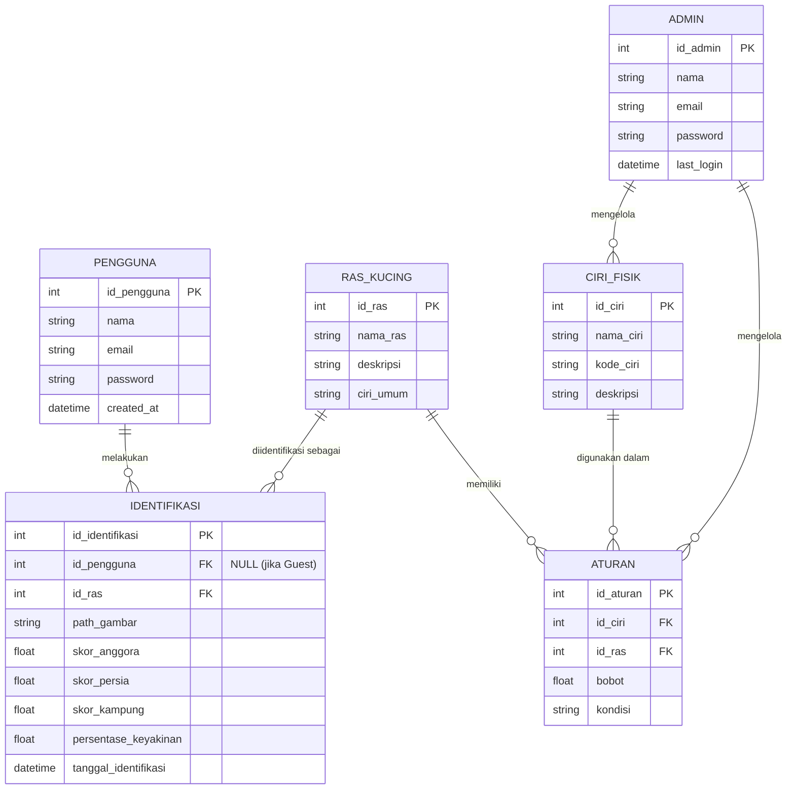

# Entity Relationship Diagram (ERD)
## Sistem Pakar Identifikasi Jenis Kucing Berdasarkan Ciri Fisik

Dokumen ini menggambarkan struktur basis data (database) yang digunakan oleh sistem pakar menggunakan **MermaidJS ERD Notation**.

---

## ERD — Entity Relationship Diagram

---

## Penjelasan Entitas & Atribut

### 1. `PENGGUNA`
Menyimpan data pengguna yang menggunakan aplikasi identifikasi.

| Atribut | Tipe | Keterangan |
|---------|------|-----------|
| `id_pengguna` | INT (PK) | Primary Key, identitas unik pengguna |
| `nama` | VARCHAR | Nama lengkap pengguna |
| `email` | VARCHAR | Email untuk login |
| `password` | VARCHAR | Password terenkripsi |
| `created_at` | DATETIME | Tanggal registrasi |

---

### 2. `RAS_KUCING`
Menyimpan data master ketiga ras kucing yang dapat diidentifikasi.

| Atribut | Tipe | Keterangan |
|---------|------|-----------|
| `id_ras` | INT (PK) | Primary Key |
| `nama_ras` | VARCHAR | Nama ras: Anggora / Persia / Kampung |
| `deskripsi` | TEXT | Deskripsi umum ras kucing |
| `ciri_umum` | TEXT | Rangkuman ciri fisik umum |

---

### 3. `CIRI_FISIK`
Menyimpan daftar semua ciri fisik kucing yang digunakan sebagai parameter identifikasi.

| Atribut | Tipe | Keterangan |
|---------|------|-----------|
| `id_ciri` | INT (PK) | Primary Key |
| `nama_ciri` | VARCHAR | Contoh: "Bulu Panjang", "Hidung Pesek" |
| `kode_ciri` | VARCHAR | Kode unik: `bulu_panjang`, `hidung_pesek` |
| `deskripsi` | TEXT | Penjelasan ciri fisik tersebut |

---

### 4. `ATURAN`
Menyimpan aturan Forward Chaining — relasi antara ciri fisik, ras, dan nilai bobotnya. Ini adalah **jantung basis pengetahuan** sistem pakar.

| Atribut | Tipe | Keterangan |
|---------|------|-----------|
| `id_aturan` | INT (PK) | Primary Key |
| `id_ciri` | INT (FK) | Relasi ke tabel `CIRI_FISIK` |
| `id_ras` | INT (FK) | Relasi ke tabel `RAS_KUCING` |
| `bobot` | FLOAT | Nilai bobot 0.0–1.0 |
| `kondisi` | VARCHAR | Kondisi aturan: misal `bulu_panjang = true` |

---

### 5. `IDENTIFIKASI`
Menyimpan riwayat setiap proses identifikasi yang dilakukan oleh pengguna.

| Atribut | Tipe | Keterangan |
|---------|------|-----------|
| `id_identifikasi` | INT (PK) | Primary Key |
| `id_pengguna` | INT (FK) | Relasi ke tabel `PENGGUNA` (NULL jika Guest/Tamu) |
| `id_ras` | INT (FK) | Hasil ras yang teridentifikasi |
| `path_gambar` | VARCHAR | Path/URL gambar yang diupload |
| `skor_anggora` | FLOAT | Total skor untuk ras Anggora |
| `skor_persia` | FLOAT | Total skor untuk ras Persia |
| `skor_kampung` | FLOAT | Total skor untuk ras Kampung |
| `persentase_keyakinan` | FLOAT | % keyakinan ras hasil identifikasi |
| `tanggal_identifikasi` | DATETIME | Waktu proses identifikasi dilakukan |

---

### 6. `ADMIN`
Menyimpan data admin/pakar yang berwenang mengelola basis pengetahuan.

| Atribut | Tipe | Keterangan |
|---------|------|-----------|
| `id_admin` | INT (PK) | Primary Key |
| `nama` | VARCHAR | Nama admin/pakar |
| `email` | VARCHAR | Email untuk login |
| `password` | VARCHAR | Password terenkripsi |
| `last_login` | DATETIME | Waktu login terakhir |

---

## Ringkasan Relasi

| Relasi | Jenis | Keterangan |
|--------|-------|-----------|
| PENGGUNA → IDENTIFIKASI | One-to-Many | Satu pengguna bisa melakukan banyak identifikasi |
| RAS_KUCING → IDENTIFIKASI | One-to-Many | Satu ras bisa menjadi hasil dari banyak identifikasi |
| CIRI_FISIK → ATURAN | One-to-Many | Satu ciri fisik bisa ada di banyak aturan |
| RAS_KUCING → ATURAN | One-to-Many | Satu ras memiliki banyak aturan ciri fisik |
| ADMIN → CIRI_FISIK | One-to-Many | Admin mengelola data ciri fisik |
| ADMIN → ATURAN | One-to-Many | Admin mengelola aturan & bobot |
