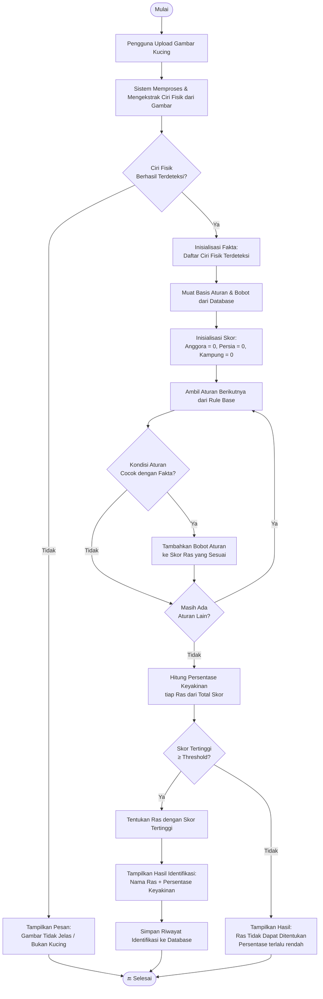
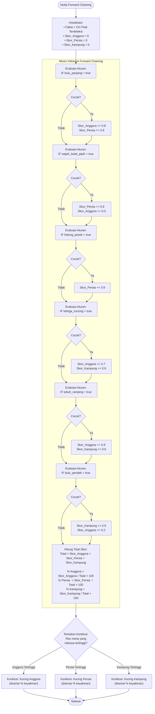

# Flowchart Logika Mesin Inferensi Forward Chaining
## Sistem Pakar Identifikasi Jenis Kucing Berdasarkan Ciri Fisik

Dokumen ini menggambarkan alur logika mesin inferensi menggunakan metode **Forward Chaining** — dimulai dari **fakta awal** (ciri fisik yang terdeteksi dari gambar) kemudian menelusuri **aturan/rules** secara berurutan hingga mencapai **konklusi** (jenis ras kucing).

---

## Flowchart Utama — Alur Sistem Keseluruhan

---

## Flowchart Detail — Proses Forward Chaining (Pencocokan Aturan)

Menggambarkan secara rinci bagaimana setiap ciri fisik yang terdeteksi dicocokkan dengan aturan dan diakumulasikan ke masing-masing ras.

---

## Contoh Simulasi Forward Chaining

Misalkan ciri fisik yang terdeteksi dari gambar adalah:
- ✅ Bulu panjang
- ✅ Wajah oval/panjang
- ✅ Telinga runcing
- ✅ Tubuh ramping
- ❌ Hidung pesek
- ❌ Bulu pendek

| Aturan yang Cocok | Skor Anggora | Skor Persia | Skor Kampung |
|-------------------|:---:|:---:|:---:|
| bulu_panjang = true | +0.8 | +0.9 | — |
| wajah_oval = true | +0.8 | — | +0.5 |
| telinga_runcing = true | +0.7 | — | +0.9 |
| tubuh_ramping = true | +0.8 | — | +0.6 |
| **Total Skor** | **3.1** | **0.9** | **2.0** |
| **Persentase** | **51.7%** | **15.0%** | **33.3%** |

> **Konklusi:** Kucing teridentifikasi sebagai **Anggora** dengan keyakinan **51.7%**
